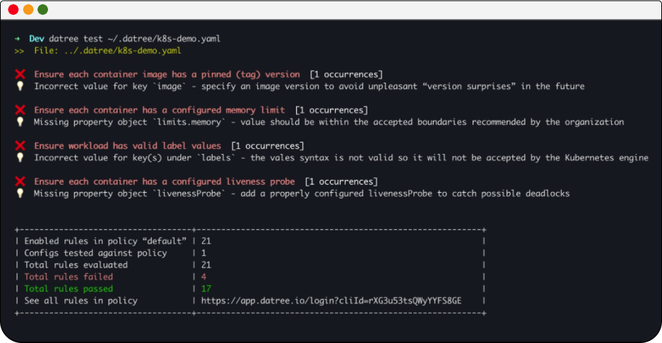

The following command will test the `k8s-demo` agaisnt 21 built-in rules to find common misconfigurations:

➡️  `datree test ~/.datree/k8s-demo.yaml`{{execute}}

There are 4 different misconfigurations in this files.  

In the terminal output you should something like that:

