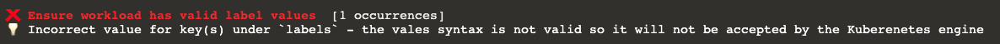

Check out the first rule violation in the terminal:  

__This violation is raised due to line #7 in `k8s-demo` file:__  
The `owner` value is an invalid label value (--) so it will not get accepted when will try to deploy this file.

### Let's fix label misconfiguration:
Replace the invalid `owner` label value with a proper string:  
<pre class="file" data-filename=".datree/k8s-demo.yaml" data-target="insert"  data-marker="--">backend-team</pre>
