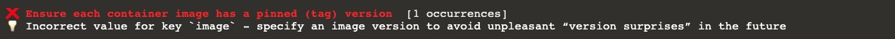

Now, check out the second rule violation in the terminal:  

__This violation is raised due to line #23 in `k8s-demo` file:__  
The `image` version tag is set as 'latest' but this can cause issues because the image is not set to a specific version.

### Let's fix image version tag misconfiguration:
Replace 'latest' (nginx:latest) with a fixed version:  
<pre class="file" data-filename=".datree/k8s-demo.yaml" data-target="insert"  data-marker="nginx:latest">nginx:1.4.6</pre>
